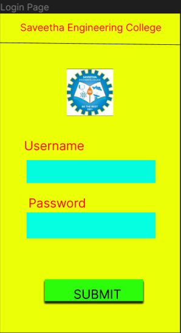
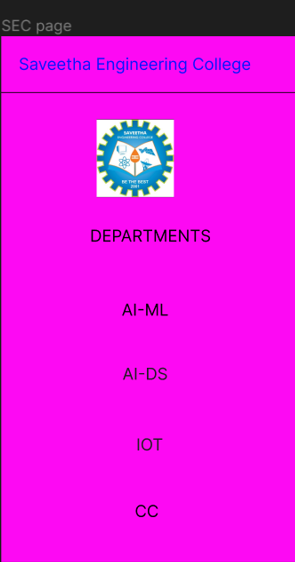
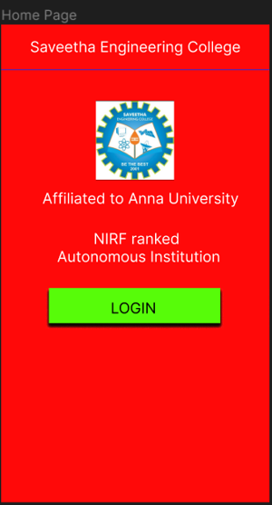

# Event Registration Web Application

## AIM:
To design, develop and deploy a web application for event registration.

## DESIGN STEPS:

### Step 1:
Create a new frame.

### Step 2:
Select any one preset size of your choice.

### Step 3:
Select the shapes you need.

### Step 4:
Import images as needed.

### Step 5:
Create pages based on your need and link them.

### Step 6:

Validate the HTML and CSS code.

### Step 6:

Publish the website in the given URL.

## DESIGN TOOL:
Figma
## CODE:
```
/* Home Page */


position: relative;
width: 360px;
height: 640px;

background: #FF0909;


/* Screenshot 2023-06-07 204225 1 */


position: absolute;
width: 94.94px;
height: 56px;

background: url(Screenshot 2023-06-07 204225.png);


/* Screenshot 2023-06-07 204225 2 */


position: absolute;
width: 105px;
height: 106.18px;

background: url(Screenshot 2023-06-07 204225.png);


/* Login Page */


position: relative;
width: 360px;
height: 640px;

background: #EBFF07;


/* SEC page  */


position: relative;
width: 360px;
height: 640px;

background: #FD09F3;
```
## OUTPUT:




## RESULT:
The program to design, develop and deploy a web application for event registration is completed successfully.